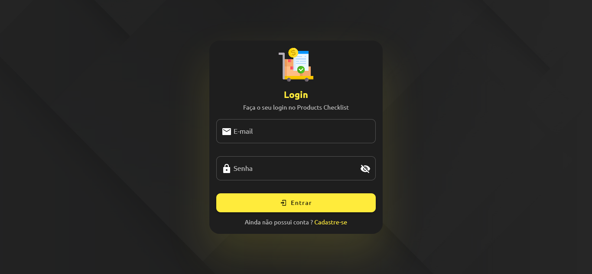

# Products Checklist :clipboard:

- Aplicação para controle de lista de compras, podendo visualizar facilmente o quanto será gasto.
- :warning: **Observação:** O back-end da aplicação se encontra no repositório [adonisjs-products-checklist](https://github.com/Lucas98Fernando/adonisjs-products-checklist), siga o passo a passo para utilização da API no README do projeto.

## Screenshots da aplicação

- Cadastro


- Login



- Dashboard


- Checklist


## :hammer: Configuração do projeto

### :heavy_check_mark: Pré-requisitos:

- Git
- Node.js
- NPM ou Yarn
- Editor de código (Recomendo utilizar o VSCode)

## :rocket: Rodando a aplicação no seu computador

### :one: Clone o repositório

```
git clone https://github.com/Lucas98Fernando/vuejs-products-checklist.git
```

### :two: Instale as dependências

```
npm install
```

ou somente:

```
npm i
```

### :three: Compilação e hot-reload para desenvolvimento

```
npm run dev
```

- **Perfeito!** :white_check_mark: Se você seguiu os passos anteriores corretamente, a aplicação estará rodando por padrão em: [http://localhost:8080](http://localhost:8080)

### :four: Compilar e minificar para produção

```
npm run build
```

### :five: Lints e corrigir arquivos

```
npm run lint
```

### Customizar configuração

Ver [Referência de Configuração](https://cli.vuejs.org/config/).
